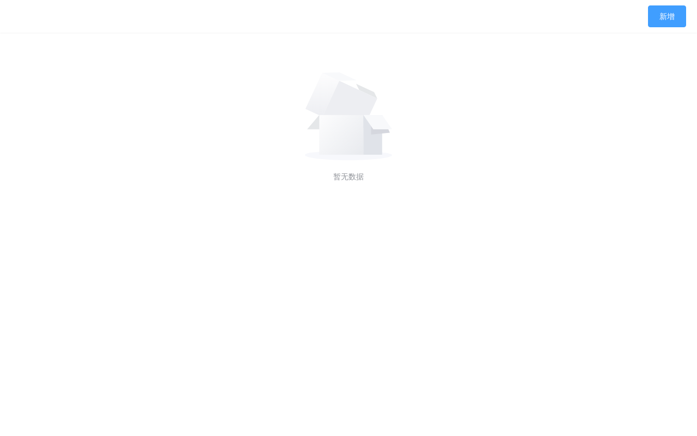

# toy-maker

基于Vue3编写的可拖拽生成落地页工具
> 主要使用Vue全家桶以及部分流行第三方库
>
> 可视化操作，拖拽生成页面，导出```HTML```文件
> 
> toy-maker是一个纯前端项目，数据采用```indexedDB```存储


### 预览地址

[toy-maker](https://toy-maker.vercel.app/)

### 安装入门

```
git clone https://github.com/lzq920/toy-maker.git
cd toy-maker
npm install  //安装依赖包
npm run generator //生成落地页组件包
npm run serve //本地开发预览
npm run build //构建生产环境资源
```

### 主要功能介绍

- [x] 元素自由拖拽、放大、缩小
- [x] 可添加图片、文本、视频、矩形(更多功能拓展中)
- [x] 组件自动吸附，实时参考线
- [x] 撤销、重做 (Ctrl + Z / Ctrl + Y)
- [x] 组件复制、粘贴 (Ctrl + C / Ctrl + V)
- [x] 组件删除 (Ctrl + D)
- [x] 组件层级上移下移(Alt + ↑ / Alt + ↓)
- [x] 编辑画布大小
- [x] 一键预览，一键导出HTML文件
- [x] 接入第三方图库以及视频库
- [x] 组件动画
- [ ] 右键菜单，复制粘贴排序等
- [ ] 图层锁定排序隐藏等
- [ ] 其他
